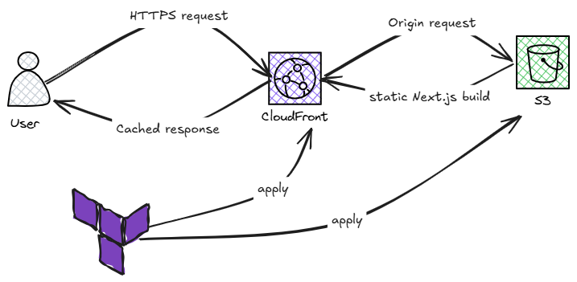

# Next.js Portfolio Deployment on AWS with Terraform

A cloud engineering project that deploys a static Next.js portfolio website to AWS using Infrastructure as Code (Terraform), with global content delivery via Amazon CloudFront.



---

## Table of Contents

- [Project Brief](#project-brief)
- [Objectives](#objectives)
- [Architecture](#architecture)
- [Tech Stack](#tech-stack)
- [Project Structure](#project-structure)
- [Deployment Steps](#deployment-steps)
- [Security & Performance Practices](#security--performance-practices)
- [Demo Video](#demo-video)
- [License](#license)

---

## Project Brief

**Client:** James Smith, freelance web designer

**Task:** Deploy a modern, responsive single-page Next.js portfolio site on AWS — one that is highly available, scalable, cost-effective, and fast for visitors worldwide.

As the cloud engineer on this project, my job was to take the client's Next.js application and design + provision the AWS infrastructure needed to host it reliably at scale, using Terraform rather than manual console setup.

## Objectives

- Deploy a Next.js website on AWS
- Provision all infrastructure with Terraform (Infrastructure as Code)
- Configure global content delivery with Amazon CloudFront
- Apply AWS security and performance best practices
- Host the full project (app + IaC) on GitHub

## Architecture

The site is built with Next.js using **Static Site Generation (SSG)** (`output: 'export'`), producing a fully static build (`out/` directory). This static output is hosted on AWS using the following stack:

| Layer | Service | Purpose |
|---|---|---|
| Static hosting | **Amazon S3** | S3 bucket configured for static website hosting (`index.html` as index/error document), serving the exported site files |
| Content delivery | **Amazon CloudFront** | Global CDN sitting in front of the S3 website endpoint — caches content at edge locations, redirects HTTP to HTTPS |
| TLS/SSL | **CloudFront default certificate** | HTTPS is provided via CloudFront's default certificate (no custom domain/ACM cert in this build) |
| Provisioning | **Terraform** | Defines and manages the S3 bucket, bucket policy, and CloudFront distribution as code |

This architecture satisfies the project requirements:

- **Highly available** — S3 and CloudFront are both globally distributed, managed AWS services with built-in redundancy
- **Scalable** — a static site behind a CDN scales automatically with traffic, with no servers to manage
- **Cost-effective** — you only pay for S3 storage/requests and CloudFront data transfer; there's no idle compute running
- **Fast loading** — CloudFront's edge locations cache and serve content close to each visitor

## Tech Stack

- **Next.js** — React framework, statically exported
- **Terraform** — Infrastructure as Code
- **AWS S3** — static website hosting
- **AWS CloudFront** — CDN / edge caching, HTTPS redirect
- **AWS provider (Terraform)** — provisions all of the above

## Project Structure

```
terraform-portfolio-project/
├── nextjs-blog/              # Next.js portfolio application
│   ├── pages/                 # File-based routing
│   ├── images/                 # Project images (e.g. architecture diagram)
│   ├── public/                 # Static assets (images, fonts, etc.)
│   ├── styles/
│   ├── .next/
│   ├── node_modules/
│   └── out/                    # Static build output (generated, deployed to S3)
│
├── terraform-nextjs/          # Infrastructure as Code
│   ├── main.tf                 # AWS provider block + backend (S3 + DynamoDB state)
│   ├── s3.tf                   # S3 bucket resource + bucket policy (static website hosting)
│   ├── cloudfront.tf           # CloudFront distribution
│   └── outputs.tf              # Bucket website endpoint + CloudFront URL
│
└── README.md
```

## Deployment Steps

### 1. Build the static site

```bash
cd nextjs-blog
npm install
npm run build
```

This generates the static export in `nextjs-blog/out/`.

### 2. Provision AWS infrastructure with Terraform

```bash
cd terraform-nextjs
terraform init
terraform plan
terraform apply
```

This creates the S3 bucket (configured for static website hosting), its bucket policy, and the CloudFront distribution.

### 3. Deploy the site to S3

```bash
aws s3 sync ../nextjs-blog/out s3://your-bucket-name
```

### 4. Get the live URL

```bash
terraform output cloudfront_url
```

Open the returned CloudFront domain in a browser to view the deployed site.

### Updating the live site

On future updates, re-run the S3 sync step and invalidate the CloudFront cache so visitors see the latest build:

```bash
aws s3 sync ../nextjs-blog/out s3://your-bucket-name
aws cloudfront create-invalidation --distribution-id <DISTRIBUTION_ID> --paths "/*"
```

## Security & Performance Practices

- CloudFront's `viewer_protocol_policy` is set to `redirect-to-https`, so all visitor traffic is served over HTTPS
- CloudFront caching (`default_ttl` / `max_ttl`) reduces load on the S3 origin and speeds up global delivery
- All infrastructure changes are version-controlled and reproducible via Terraform

> **Note:** The S3 bucket uses static website hosting with a public read policy (required for the S3 website endpoint to work as a CloudFront origin). A stricter setup would use CloudFront Origin Access Control (OAC) with a private bucket instead — a good next step for hardening this project.

## Demo Video

📺 [Watch a walkthrough of the Next.js code structure and AWS architecture](your-loom-link-here)

## License

This project was built as a portfolio/learning exercise based on a client-brief style AWS deployment scenario.
